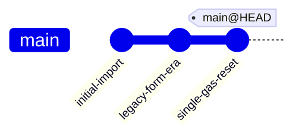
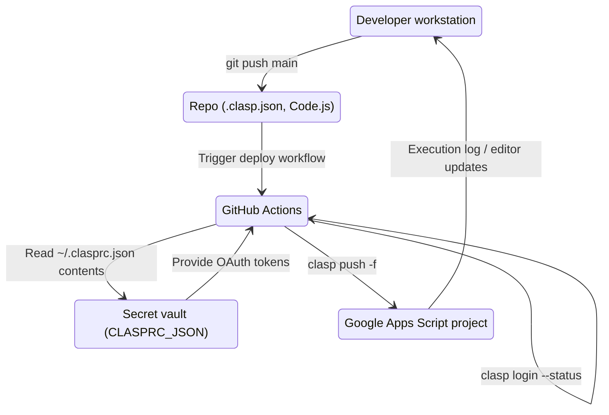
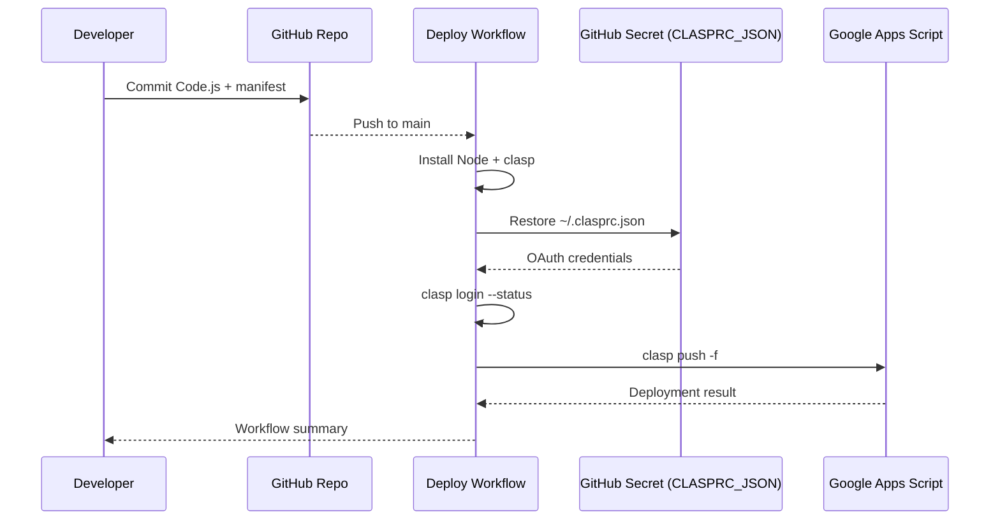
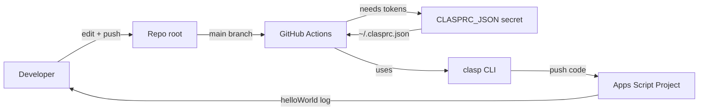
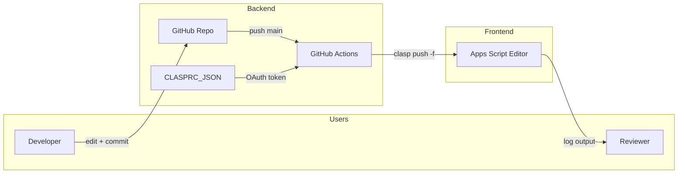

# clasp-from-fresh











## Single Apps Script project at repo root

This repository now tracks one standalone Google Apps Script project directly from the root directory. All deployment tooling and workflow files target the same code to keep the CI/CD loop simple.

### Repository layout

```text
.
├─ .clasp.json
├─ appsscript.json
├─ Code.js
├─ package.json
└─ .github/
   └─ workflows/
      └─ deploy-gas.yml
```

### Getting started locally

1. Install clasp globally (`npm install -g @google/clasp`).
2. Run `clasp clone <SCRIPT_ID>` or update `.clasp.json` with your `scriptId`.
3. Authenticate once via `clasp login`.
4. Modify `Code.js`, then deploy either with `clasp push -f` or by running `npm run deploy`.

### GitHub Actions deployment

The workflow defined in `.github/workflows/deploy-gas.yml` automatically deploys every push to `main`. Provide the secret `CLASPRC_JSON` that mirrors the contents of your local `~/.clasprc.json`. The workflow restores those credentials, verifies login status, and performs `clasp push -f`.

### Hello World entry point

`Code.js` exposes `helloWorld()`, which writes a log entry: `Hello from single-repo GAS + GitHub Actions!`. Use the Apps Script editor's **Run** button or the Executions tab to see the log output.
